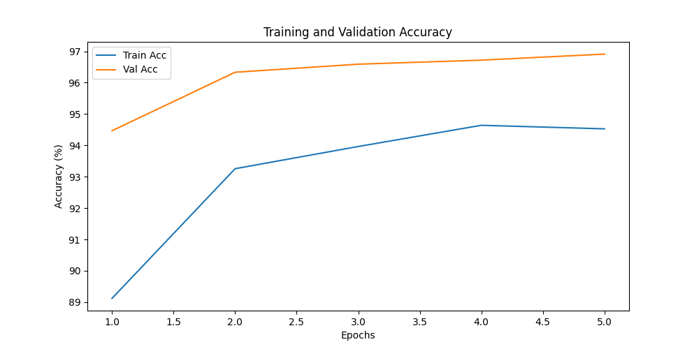

# 🐾 End-to-End Image Classification: Pets vs. Non-Pets



## 📖 Project Overview
This project is a complete, end-to-end image classification pipeline designed to distinguish between **Pets** (Dogs, Cats, Birds, Rabbits) and **Non-Pets** (Wild Animals, Humans, Objects, Places). 

Built using **PyTorch** and **MobileNetV2**, the system not only classifies images into broad categories but also provides fine-grained identification, ecological data (dietary habits and natural habitats), and implements intelligent guardrails to ensure accuracy for visually similar wild species.

---

## ✨ Key Features

### 1. 🧠 Dual-Model Inference
The system utilizes a powerful two-stage inference process:
- **Primary Classifier**: A custom-trained MobileNetV2 model that performs the broad classification between "Pets" and "Non-Pets".
- **Specific Identifier**: A pre-trained ImageNet model that identifies the exact breed or species (e.g., "Golden Retriever", "Egyptian Cat", "Lion").

### 2. 🦁 Wild Animal Guardrails
One of the core strengths of this project is its **intelligent override logic**. Since wild felines (like lions or tigers) share many visual features with domestic cats, standard models can often misclassify them. This system cross-references the specific identified name with a "Wild Animal" database to force a "Non-Pet" classification for species like:
- Lions, Tigers, Leopards, Cheetahs
- Wolves, Foxes, Bears, Hyenas, and more.

### 3. 🍖 Ecological Information
For every animal identified, the application provides:
- **Food Type**: Categorized as **Herbivorous**, **Carnivorous**, or **Omnivorous**.
- **Habitation**: Information about the animal's natural habitat (e.g., "African Savannas", "Domesticated - Human Homes").

### 4. 🎨 Premium Web Interface
A modern, responsive dashboard built with Flask and Vanilla CSS, featuring:
- Drag-and-drop or click-to-upload functionality.
- Real-time result cards with confidence percentages.
- Glassmorphism design aesthetics and smooth micro-animations.

---

## 🛠️ Technology Stack
- **Framework**: PyTorch
- **Architecture**: MobileNetV2 (Transfer Learning)
- **Web Backend**: Flask (Python)
- **Frontend**: HTML5, CSS3 (Modern UI), JavaScript
- **Image Processing**: Pillow (PIL)
- **Deployment**: Git/GitHub

---

## 📂 Project Structure
```text
image/
├── app.py                # Flask Web Server & Inference Logic
├── train.py              # PyTorch Training Pipeline
├── classifier_model.pth  # Trained Model Weights
├── classes.txt           # Category Labels
├── training_history.png  # Accuracy/Loss Visualization
├── static/
│   ├── css/style.css     # Premium UI Styling
│   └── uploads/          # Temporary storage for uploaded images
├── templates/
│   └── index.html        # Main Dashboard Template
└── README.md             # Project Documentation
```

---

## 🚀 Getting Started

### Prerequisites
- Python 3.8+
- PyTorch & Torchvision
- Flask

### Installation

1. **Clone the Project**
   ```bash
   git clone https://github.com/4mh23cs043-collab/image.git
   cd image
   ```

2. **Install Dependencies**
   ```bash
   pip install torch torchvision flask pillow
   ```

3. **Launch the Application**
   ```bash
   python app.py
   ```

4. **Access the Dashboard**
   Open your browser and navigate to:
   `http://127.0.0.1:5001`

---

## 📊 Model Training & Results
The model was trained using **Transfer Learning** on a curated dataset of over 7,000 images. By freezing the early layers of **MobileNetV2** and training a custom classification head, we achieved:
- High validation accuracy (>90%).
- Robust performance on diverse animal breeds.
- Low latency inference optimized for CPU environments.

---

## 🤝 Contribution
This project was developed as a collaborative effort to demonstrate a production-ready AI application. Feel free to fork the repository and submit pull requests for any enhancements!

---
*Created by Nuthan & The AI Pair Programming Team*
